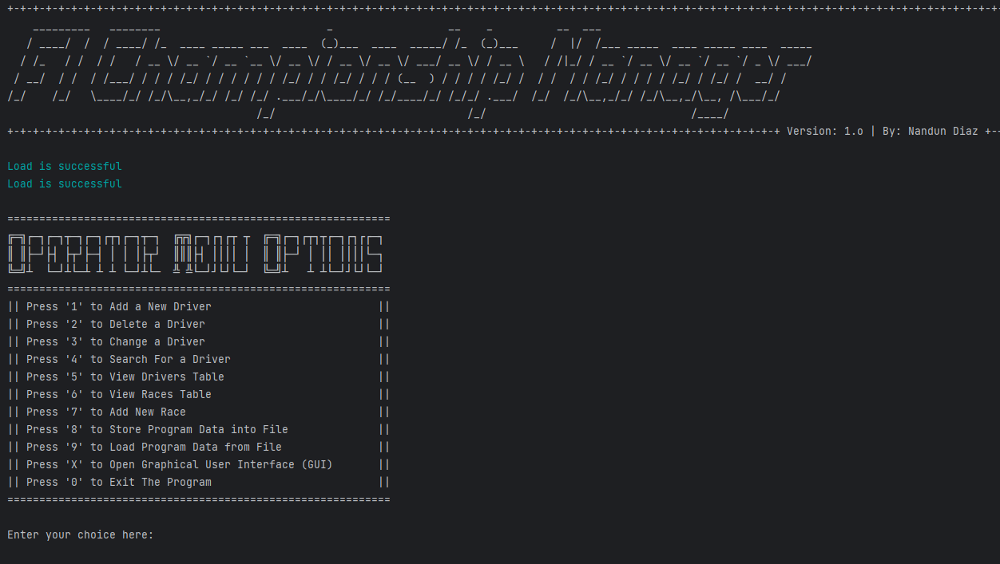

# Formula 1 Championship Manager Simulator

Welcome to the Formula 1 Championship Simulator project! This Java program allows you to simulate and manage a Formula 1 racing car championship, complete with drivers, constructor teams, races, and statistics. The project focuses on both text-based and graphical user interfaces (GUI) using Java Swing.

## Overview

In this project, you'll find a comprehensive implementation of a Formula 1 championship management system. The core features and functionalities are divided into two parts:

### Text-Based Interface

#### Championship Management

- Create and manage drivers associated with unique constructor teams.
- Delete drivers and their respective teams from the championship.
- Change the driver for an existing constructor team.
- Display various statistics for a selected driver.
- View the Formula 1 Driver Table, ranking drivers by points and considering race wins.
- Add completed races with dates and driver positions.
- Save all entered information in a file.
- Resume the program from a saved state on subsequent runs.

### Graphical User Interface (GUI)

The GUI adds an interactive and visually appealing layer to the championship management system. It includes features like:

#### Driver Statistics Table

- Display a sortable list of all drivers and their statistics in descending order of points.
- Allow users to sort the table by points won in ascending order.
- Enable users to sort the table by the largest number of first-place wins in races (descending order).

#### Simulated Races

- Generate a random race with random positions achieved by existing drivers.
- Automatically update the Formula 1 championship table with race results.
- Provide a visual representation of the race results for user verification.

#### Probabilistic Races

- Simulate a full race with drivers starting in randomly calculated positions.
- Determine race results probabilistically based on starting positions.
- Allow users to witness race outcomes and updates in the championship table.

#### Race History

- Display a list of all completed races sorted in ascending order of date.
- Access all races played in the season, including those entered manually or generated in previous runs.

#### Driver Race Search

- Search for all races in which a specific driver participated.
- View detailed race information, including dates and driver positions.

## Usage

To use this program, follow these steps:

1. Clone this repository to your local machine.
2. Compile and run the Java program.
3. Use the text-based menu to interact with the championship management system.
4. Access the GUI features for a more interactive experience.

## Project Structure

The project is organized into several Java classes, each responsible for specific functionalities, including Driver, Formula1Driver, Formula1ChampionshipManager, and the GUI components.

## Contributors

- [Nandun DIaz](https://github.com/Bunny77K9)

## License

This project is licensed under the [MIT License](LICENSE).

## Acknowledgments

I would like to express my gratitude to our senior lecturer Mr. Saman Hettiarachchi for the assignment specifications and guidance throughout the development process.

Feel free to contribute, enhance, or customize this project to meet your specific needs. Enjoy managing your own Formula 1 championship manager, and may the best driver win!
